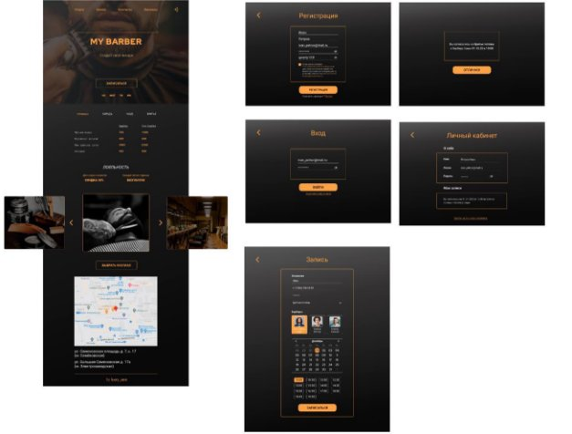
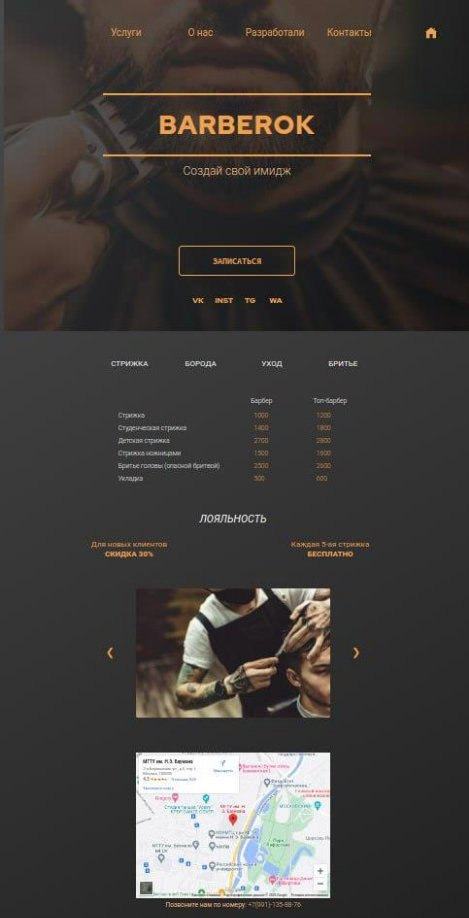
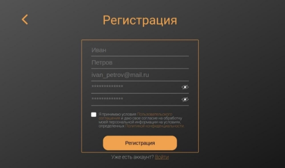
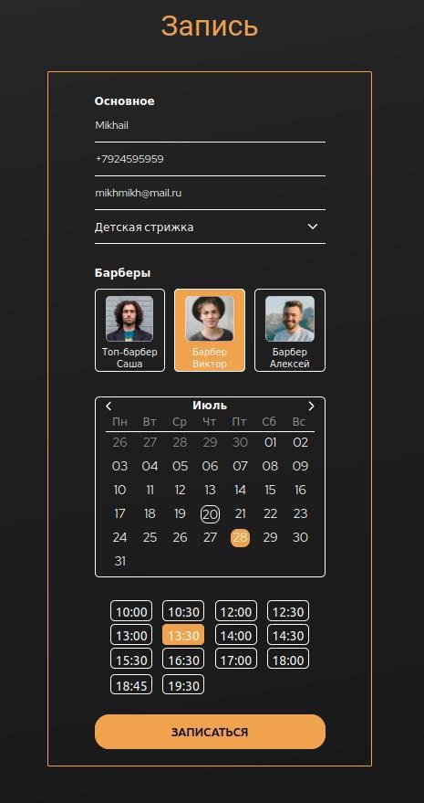
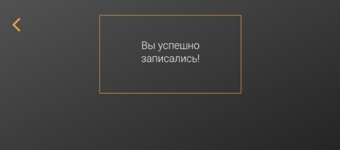
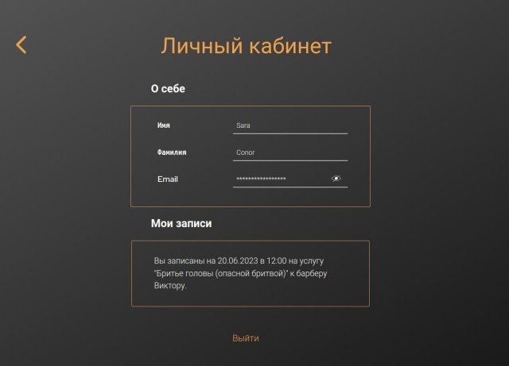

**СОДЕРЖАНИЕ** 

[ЦЕЛИ И ЗАДАЧИ ПРОЕКТА................................................................................](#_page2_x82.00_y59.92)

[ОПИСАНИЕ ПРОЕКТА .........................................................................................](#_page3_x82.00_y59.92)

[Требования к разработке сайта ......................................................................](#_page3_x82.00_y216.92)

[Структура веб-сайта для барбершопа ...........................................................](#_page3_x82.00_y490.92)

[РЕАЛИЗАЦИЯ ПРОЕКТА .....................................................................................](#_page6_x82.00_y59.92)

[Front-end разработка ..........................................................................................](#_page6_x82.00_y168.92)

[Back-end-разработка ...........................................................................................](#_page8_x82.00_y252.92)

[ЗАКЛЮЧЕНИЕ ........................................................................................................](#_page15_x82.00_y252.92)

**ЦЕЛИ И ЗАДАЧИ ПРОЕКТА** 

Цель  проекта  -  разработка  веб-приложения  с  использованием фреймворка Django. Для этого были решены следующие задачи 

- проектирование и прототипирование веб-приложения с использованием Figma; 
- разработка серверной логики и моделей данных с использованием Django; 
- разработка шаблонов отображения данных с помощью HTML, CSS и JavaScript; 
- разработка  сопроводительной  документации  по  запуску  веб-приложения; 
- публикация и развертывание веб-приложения; 
- оформление пояснительной записки к проекту. 

**ОПИСАНИЕ ПРОЕКТА**  

В данном проекте было необходимо разработать CRM-систему барбершопа с использованием фреймворка Django. Для салона MY BARBER требовалось  сделать  главную  страницу  с  навигацией  по  сайту,  контактной информацией и прайс-листом, разработать форму для записи клиентов, регистрацию и авторизацию пользователей. 

**Требования к разработке сайта**  

В данном проекте необходимо было организовать многопользовательский доступ к базе данных. В связи с этим должна быть реализована регистрация и авторизация пользователей, а также предоставление уникальной информации для каждого клиента. При вводе данных пользователем должна осуществляется проверка информации на корректность. Также сайт должен содержать меню с возможностью перемещения между разделами.  

Оформление сайта должно быть выполнено с использованием HTML+CSS для создания  качественного  визуального  представления  информации.  Последнее включает в себя использование определенных шрифтов, соблюдение заданной стилистики и удобное расположение блоков с информацией. 

**Структура веб-сайта для барбершопа** 

Структурная схема проекта представлена на рисунке 1. Функционал веб- сайта  для  барбершопа  предоставляет  возможность  регистрации  нового пользователя  и  прохождение  авторизации  клиентом,  уже  внесенным  в  базу. Последние  получают  доступ  к  личному  кабинету,  в  котором  отображаются данные  пользователя  и  информация  о  записи  на  предстоящее  посещение барбершопа с указанием вида услуги. Страница записи содержит поля для ввода данных  клиента,  панель  с  выбором  мастера,  календарь  и  доступное  для посещения время.  

    

 

    Рисунок 1 一 Структурная схема сайта

Главная  страница  веб-сайта  включает  в  себя  панель  управления, информацию о предоставляемых услугах, слайды фотографий, карту города с указанием  геопозиции  здания  и  контактную  информацию.  в  услугах  можно выбрать  необходимый  раздел  (стрижка,  бритье,  уход  или  борода),  а  также ознакомиться с действующими акциями. На странице записи присутствуют поля с  основными  данными  клиента,  выбором  мастера,  а  также  даты  и  времени записи.  После  заполнения  форм  на  странице  регистрации/авторизации пользователь может зайти в свой личный кабинет, в котором будет информация о записях в салон, если они есть. 

**РЕАЛИЗАЦИЯ ПРОЕКТА** 

После определения требований к разрабатываемому проекту и описания его функционала осуществляется формирование макета дизайна сайта. После этого выполняется верстка страниц и программирование функциональной части. 

**Front-end разработка** 

Для разработки интерфейса и прототипирования сайта был использован онлайн-сервис "Figma". Макет проекта представлен на рисунке 2. 

    

 

    Рисунок 2 一 Макет проекта

 

UI-компоненты  были  выполнены  с  помощью  фреймворка  Bootstrap.  В верхней  части  («Header»)  главной  страницы  приведено  меню,  по  которому осуществляется  навигация  по  сайту  барбершопа.  Данное  меню  состоит  из следующих ссылок: 

«Услуги»  -  при  нажатии  по  которой  происходит  перемещение  в  часть главной страницы, где в виде таблицы указаны мастера, виды предоставляемых услуг и цены; 

«О  нас»  -  при  нажатии  по  которой  пользователь  перенаправляется  на страницу, в которой можно ознакомиться с общей информацией о барбершопе и некоторыми фотографиями процесса работы; 

«Разработали» - при нажатии по которой пользователь перенаправляется на страницу, в которой представлены разработчики сайта; 

«Контакты» - при нажатии по которой происходит перемещение в нижнюю часть главной страницы, в которой приведено местоположение барбершопа на карте и указан телефон для связи с администратором. Перемещения по частям главной страницы выполнены при помощи использования якорей. 

В верхнем правом углу страницы расположена иконка в виде ссылки, по которой осуществляется переход в личный кабинет клиента. Также в «Header» расположена кнопка «Записаться», при нажатии по которой происходит переход на страницу записи к мастеру. Ниже приведены ссылки на страницы барбершопа в социальных сетях. 

В  средней  части  главной  страницы  расположена  таблица,  в  которой приведены виды услуг по категориям «стрижка», «борода», «уход» и «бритье», а также цены. У клиента есть возможность выбора двух видов мастеров: барбера или топ-барбера.  

Далее  приведена  информация  о  лояльности,  согласно  которой  новым клиентам предоставляется скидка 30%, а каждая пятая стрижка осуществляется бесплатно. Ниже расположен слайдер с фотографиями процесса работы. 

В нижней части главной страницы приведено местоположение барбершопа на карте и указан телефон для связи с администратором. 

При  этом  для  главной  страницы  осуществлена  адаптивная  верстка. Информация на странице при различной ширине экрана располагается удобно для клиента. 

В странице личного кабинета клиента приводятся данные «О себе» в виде его имени, фамилии и логина. Логин можно отобразить или скрыть при нажатии на  иконку  глаза  в  левой  части  соответствующей  ячейки,  чтобы  было осуществлено при помощи js. Также приведены данные «Мои записи», где в указана информация о дате записи, услуге и выбранном мастере. 

При  нажатии  на  стрелку  в  левой  верхней  части  страницы  происходит возврат  на  главную  страницу,  а  выход  из  личного  кабинета  осуществляется нажатием на ссылку с соответствующим названием в нижней части страницы. 

**Back-end-разработка** 

Back-end часть проекта реализована на Python с помощью фреймворка Django, локальный сервер был понднят с использованием Gunicorn. Для корректной обработки  и  загрузки  статических  файлов,  которые  были  предварительно собраны в папку static в корневой директории веб приложения использовался Whitenoise. 

При  переходе  на  сайт  происходит  отображение  главной  страницы, реализация  которой  находится  внутри  main,  данное  приложение  является связующим  звеном  между  всеми  частями  сайта  с  встроенным  меню  и различными возможностями отображения других страниц. 

Главная страница может быть представлена в двух видах в зависимости от того, авторизован пользователь или нет. У авторизованного пользователя есть доступ к личному кабинету, а у неавторизованного – есть возможность  перейти  к  авторизации.  В  остальных  возможных  переходах главные  страницы  идентичны,  на  рисунке  3  представлена  главная  страница авторизованного пользователя. 

    

    Рисунок 3 一 Главная страница авторизованного пользователя

Для  реализации  авторизации  и  регистрации  потребовалось  создать структуру пользователя  Custom  User, наследованную от стандартного  класса User  встроенного  в  Django,  но  с  переопределением  структуры  класса  таким образом, чтобы в качестве логина выступала электронная почта пользователя. Реализацию  можно  посмотреть  в  соответствующем  приложении  accounts.  В регистрации и  авторизации  предусмотрены  процедуры  валидации  введённых данных,  при  некорректности  которых  получаем  сообщения  об  ошибках  в соответствующих  полях  формы,  которую  заполняет  пользователь  в  каждом случае.  Внешний  вид  страницы  регистрации  и  авторизации  представлен  на рисунке 4 и рисунке 5 соответственно. 

    

    Рисунок 4 一 Страница авторизации

    

    Рисунок 5 一 Страница регистрации

Код, отвечающий за работу записи, прописан в приложениях appointment. Параметры  записи  такие,  как  имя,  номер  телефона,  почта  и  т.д.  вводятся пользователем на соответствующей странице и передаются в базу данных. В панели администратора можно посмотреть пользовательские записи.  

На  рисунке  6  представлен  внешний  вид  страницы  записи,  которая заполняется  пользователем  и  обрабатывается  с  помощью  формы.  Рисунок  7 показывает сообщение, которое получает пользователь  в случае, если запись произошла  успешно  и  БД  обновлена.  Структура  записей  выглядит  таким образом, как отображено на рисунке 8. 

    

    Рисунок 6 一 Страница записи

    

    Рисунок 7 一 Перенаправление на страницу подтверждения записи

    

    Рисунок 8 一 Запись пользователя в базе данных

Помимо  вышеуказанного  реализован  личный  кабинет  пользователя,  в котором отображается уникальный контент, сообщающий о том, когда и на какое время он записан. Эта информация берётся из БД записей, в которой происходит поиск по соответствию электронной почты пользователя с имеющимися там, в случае наличия записи, она отображается, в противном случае – отображается, что записей пока нет. Внешний вид личного кабинета представлен на рисунке 9. 

    

    Рисунок 9 一 Страница личного кабинета

Стоит отметить, что в веб приложении был задействован фреймворк REST, который позволяет получить доступ к информации о структуре пользователей, к их редактированию и удалению при необходимости, данный функционал добавлен для удобства работы с полями класса пользователей и при разворачивании только на локальном сервере. 

**ЗАКЛЮЧЕНИЕ** 

В  результате  выполнения  проекта  была  разработана  упрощённая CRM-система барбершопа с использованием фреймворка Django. Командное взаимодействие происходило через Gitlab, развернутый на сервере МГТУ им. Н.Э. Баумана. В ходе  выполнения  работы  были  реализованы  и  использованы  следующие технические аспекты: 

- фреймворк Bootstrap; 
- меню навигации по разделам 
- несколько связанных сущностей (пользователь - мастер - время записи) 
- наличие  компонент,  отображающих  данные  в  виде  списка,  а  также использование форм 
- CRUD подход 
- обработка ошибок 
- проверка данных на корректность 
- валидация данных в формах 
- авторизация и регистрация пользователей 
- исходный код проходит проверку PYLINT-DJANGO
